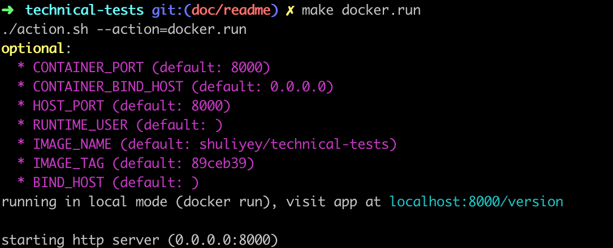

# Overview

ANZ technical zeyu

## 1. Pre-requirements (to be setup locally)

### 1.1 Git

assuming you are familiar with git (and already have git installed and configured

```bash
git clone https://github.com/Shuliyey/technical-tests.git
cd technical-tests
```

### 1.2 Local build environment requirements

below terminal **applications/tools** needs to be installed

* bash
* docker
* make
* curl
* kubernetes-cli (kubectl)

## 2. Tasks/Steps

### 2.1 Q1 - Dockerfile Multistage Build and Optmisation

The finalised `Dockerfile` is available at [Dockerfile](./Dockerfile)

* multi-stage build
  * the `builder` section will be responsible of producing the final application binary `/app/golang-test`
  * the final docker image uses `alpine` as the minimal based image and port the final application `/app/golang-test` produced by the `builder` section. This keeps the final image at its minimum, as the runtime image doesn not need a full dependency to build the application
* cache optmisation
  * `Dockerfile` structure has been designed to achieve cache optmisation as it puts the static defined steps before the dynamic dependend steps, meaning the static steps will be cached for optmisation

### 2.2 Q2 ̨- Application, Containerisation and CICD pipeline

for more details on

* cicd - branching strategy, versioning, release page, github actions and etc.
* testing - unit testing, lint test
* running/building the application locally
* dockerization on the application

refer to [q2-application-containerisation-and-cicd-pipeline](readme/q2-application-containerisation-and-cicd-pipeline.md)

#### 2.2.1 make

* test

```bash
make go.test
```

* run locally

```bash
make go.run
```

* build locally

```bash
make go.build
```

* build docker image

```bash
make docker.build
```

* run docker image

```bash
make docker.run
```

**Note: make sure the `HOST_PORT` is available and not in use by other processes**

there'll be message indicating the `local url` to visit (**running in local mode (docker run), visit app at localhost:`HOST_PORT`/version**), below is an example



#### 2.2.2 github-actions

cicd pipeline is implemented in [github actions](https://github.com/features/actions), pipeline is defined in [.github/workflows/go.yml](.github/workflows/go.yml)

list of triggered pipelines can be visited on the repo's github-actions page (https://github.com/Shuliyey/technical-tests/actions)


below are three examples of triggered pipelines

* [456994692](https://github.com/Shuliyey/technical-tests/runs/456994692?check_suite_focus=true) (on push to `master` branch)
* [456989568](https://github.com/Shuliyey/technical-tests/runs/456989568?check_suite_focus=true) (on push to `'*/*'` branch)
* [456992006](https://github.com/Shuliyey/technical-tests/runs/456992006?check_suite_focus=true) (on pull_request to `master` branch)
* [456898515](https://github.com/Shuliyey/technical-tests/runs/456898515?check_suite_focus=true) (on push `'v*'` tags)

### 2.3 Extra - Deployments (Kubernetes)

#### 2.3.1 make

assuming your local `kubectl` is already pointing to the desired kubernetes context (this can be verified through `kubectl config current-context`)

* deploy application manifests to kubernetes

```bash
make up
```

**there'll be a section (like below) indicating the endpoint to visit the application and more information such as tailing the application service logs**


* remove application manifests from kubernetes

```bash
make down
```

* more info refer to [extra-kubernetes](readme/extra-kubernetes.md) **(note: the `make up` and `make down` are self explanatory and does the creation and removal of the required application resources on kubernetes, this is just for more reference)**

## 3. References

### 3.1 Github Actions & Github Packages
* https://github.com/features/packages
* https://help.github.com/en/actions/reference/workflow-syntax-for-github-actions
* https://github.community/t5/GitHub-Actions/set-output-Truncates-Multiline-Strings/td-p/37870
* https://help.github.com/cn/actions/reference/contexts-and-expression-syntax-for-github-actions
* https://github.community/t5/GitHub-Actions/run-step-on-if-branch-tag-is/td-p/38874
* https://github.com/actions/upload-artifact
* https://github.com/actions/create-release
* https://github.com/actions/upload-release-asset
* https://github.com/marketplace/actions/publish-docker
* https://github.community/t5/GitHub-Actions/Github-Actions-CI-CD-pipeline-branch-gt-master-gt-release-tag/td-p/29924

### 3.2 Kubernetes
* https://kubernetes.io/docs/tutorials/stateful-application/zookeeper/#tolerating-node-failure
* https://kubernetes.io/docs/tasks/run-application/horizontal-pod-autoscale-walkthrough/
* https://kubernetes.io/docs/tasks/administer-cluster/namespaces-walkthrough/
* https://kubernetes.io/docs/concepts/services-networking/connect-applications-service/
* https://www.freeformatter.com/mime-types-list.html
* https://kubernetes.io/docs/tasks/run-application/horizontal-pod-autoscale/