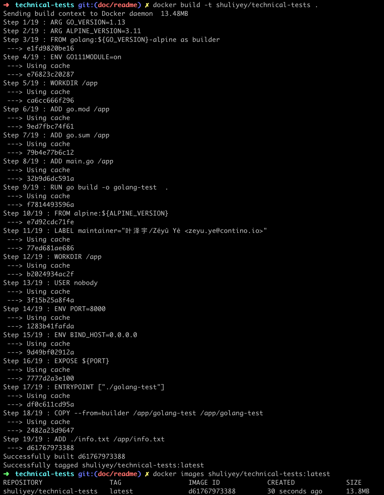
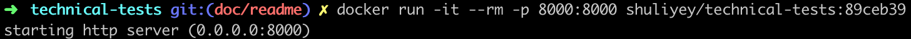
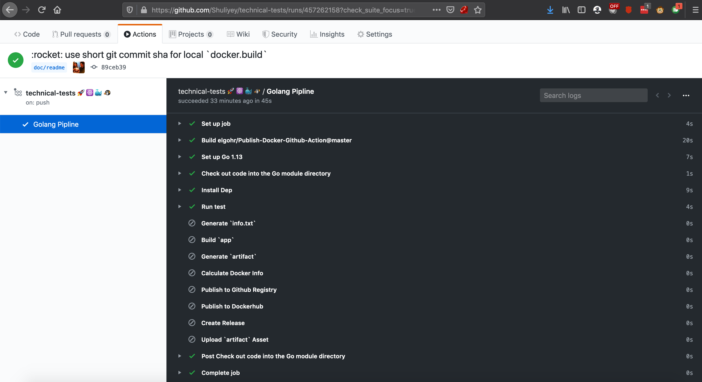
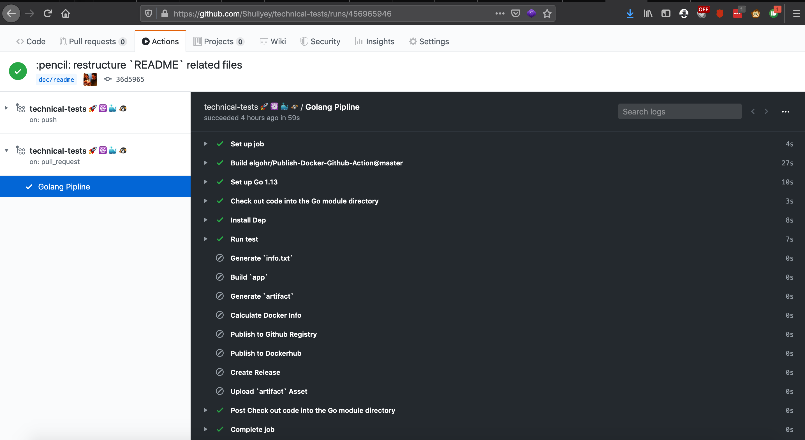
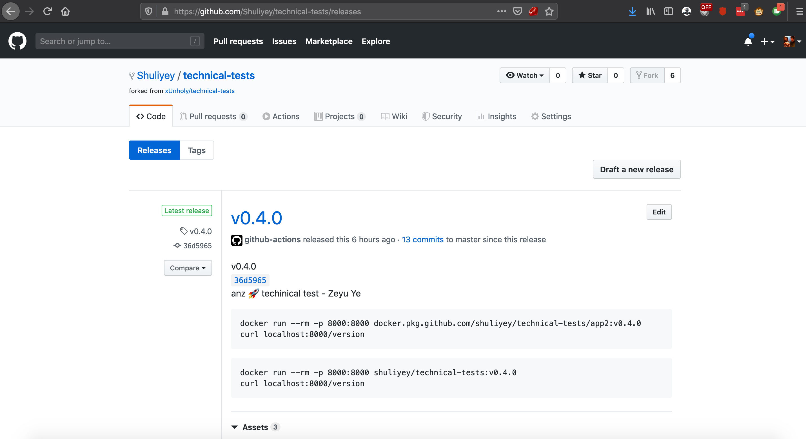

# q2 - Application, Containerisation and CICD pipeline

## 1. summary

application is a simple http golang application, if you have install local `go` environment.

* you can run the application locally through

```bash
make info.generate
go run main.go
```

below is a screenshot of the application in the browser


* if you have golint installed under **GOPATH** (`go get -u golang.org/x/lint/golint`)

```bash
${GOPATH:-${HOME}/go}/bin/golint .
```

* you can run go unit test locally through

```bash
go test
```

below is a screenshot of unit test results


* you can build custom docker images (assume you installed `docker` locally) locally through

```bash
make generate-info
docker build -t <name>:<tag> .
```

below is a screenshot of custom docker build



* you can run the custom docker images (assume you installed `docker` locally) locally through

```bash
docker run -it --rm -p 8000:8000 <name>:<tag>
```

**Note: make sure the `8000` is available and not in use by other processes**

below is a screenshot of run custom docker



## 2. local build environment requirements

* inherit local build environment requirements defined in [main](../README.md#12-local-build-environment-requirements)
* [go](https://github.com/golang/go)

## 3. application environment variables

below are the application environment variables

* **BIND_HOST** (optional, default: "0.0.0.0", {type: string})
* **PORT** (optional, default: 8000, {type: integer, range: [0, 65535]})

## 4. docker image design

### 4.1 docker `multistage` build

[Dockerfile](../Dockerfile) to build the application image uses `multistage` build to optimise the final application image size/structure, first stage uses `golang` as the base image to build the final binary (`app`), this binary (`app`) is the only artifact that gets passed/embedded to the next stage (which is a clean `alpine` base image)

### 4.2 `nobody` at docker application runtime

to ensure enhanced application security at run time, the final docker image use `nobody` (**no** `root` permission) as the default runtime user

## 5. cicd pipeline, release and packages

### 5.1 cicd pipeline - github-actions

cicd pipeline is implemented in [github actions](https://github.com/features/actions), pipeline is defined in [.github/workflows/go.yml](../.github/workflows/go.yml)

pipeline follows below branching designs


pipeline will trigger on the below events

1. **push to `master` branch**

pipeline triggered under this event will run

* `run test`
* `build artifacts`
* `build docker images`
* `push image to github package registry`
* `push image to dockerhub registry`

example of triggered pipeline on `master` branch [456994692](https://github.com/Shuliyey/technical-tests/runs/456994692?check_suite_focus=true) (on push to `master` branch)


2. **push to `'*/*'` branch**

pipeline triggered under this event will run

* `run test`
* `build artifacts`



3. **pull_request to `master` branch**

pipeline triggered under this event will run

* `run test`
* `build artifacts`



4. **push `'v*'` tags**

pipeline triggered under this event will run

* `run test`
* `build artifacts`
* `build docker images`
* `push image to github package registry`
* `push image to dockerhub registry`
* `create release`
* `upload release artifacts`

example of triggered pipeline on `v*` tags [456898515](https://github.com/Shuliyey/technical-tests/runs/456898515?check_suite_focus=true)


### 5.2 release and packages - github-release-page and github-packages

* list of available releases is at https://github.com/Shuliyey/technical-tests/releases



* list of available github package hosted docker registries is at https://github.com/Shuliyey/technical-tests/packages/128817/versions


## 6. make tasks

### 6.1 docker.build (`make docker.build`)

builds the application docker image

below environment variables can be altered

* **ALPINE_VERSION** (optinal, default: [grabs the latest version from https://golang.org/VERSION?m=text])
* **GO_VERSION** (optional, default: [grabs the latest version from http://dl-cdn.alpinelinux.org/alpine/])
* **IMAGE_NAME** (optional, default: shuliyey/technical-tests)
* **IMAGE_TAG** (optional, default: $(git rev-parse --short HEAD))
* **GENERATE_INFO** (optional, default: true)

### 6.2 docker.run (`make docker.run`)

runs the application docker image

below environment variables can be altered

* **CONTAINER_PORT** (optional, default: 8000)
* **CONTAINER_BIND_HOST** (optional, default: "0.0.0.0")
* **HOST_PORT** (optional, default: 8000)
* **RUNTIME_USER** (optional, default: (this uses default docker runtime user specified in `Dockerfile`))
* **IMAGE_NAME** (optional, default: shuliyey/technical-tests)
* **IMAGE_TAG** (optional default: $(git rev-parse --short HEAD))

**Note: make sure the `HOST_PORT` is available and not in use by other processes**

## 7. notes

the nature of `golang` packages the final application (alone with its dependencies, such as external or native host level libraries) into a executable single binary, this fits with microservice containers with reduced image size, runtime performance, high security and great portability
